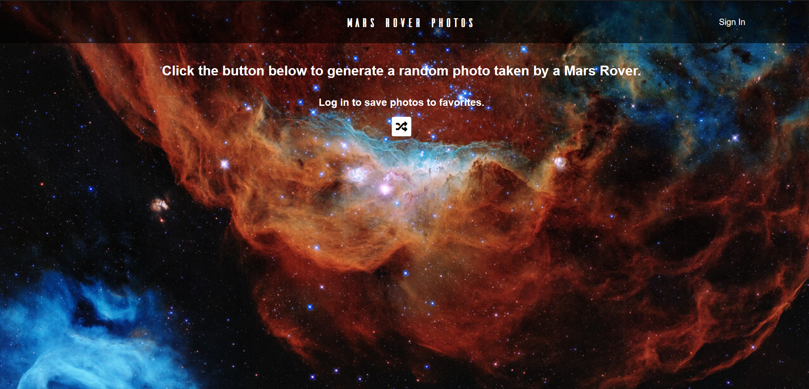

# Mars Rover Photo Generator

This is a simple React app where a user can create an account, generate random photos taken by  Mars Rovers, and save the photo to their favorites list. 

Over the summer, I discovered a fantastic documentary series on Nova about our solar system. I absolutely love stuff about space, but found this new series particularly interesting. They dive into detail about all the planets that I truly never knew. For example -- I had no idea that Venus was an insanely hot hell-world with crushing atmospheric pressure. I knew of course that humans couldn't live there, but I didn't know about the specific quality of the surface. 

An insight they had about Mars was also particularly fascinating. Scientists believe that billions of years ago, Mars was probably a lot like our earth today, Venus as well. Mars is a special case though, because it is one of the only planets or moons where we have had extensive surface exploration. 

As I was looking for ideas of a good project, I went to the NASA website, and discovered they had lots of great API’s, one of them being an API for seeing photos taken by Mars Rovers. 

